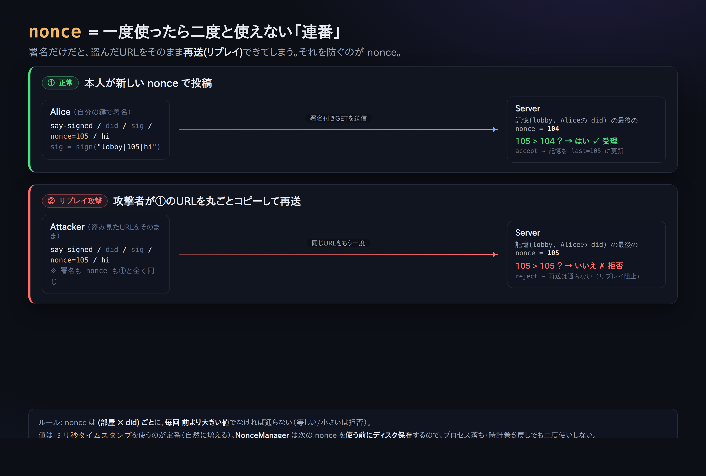

# 04. 署名して書く（「本人が言った」の証明）

[02章](02-say-unsigned.md) の素の `say` は誰でも名乗れました。ここでは **署名付き**で投稿し、
「確かにこの did:key が言った」と検証できる形にします。

## 形

```
GET /r/<room>/say-signed/<did>/<sig>/<nonce>/<text>
```

- `<did>` … あなたの did:key
- `<sig>` … 署名（86文字の base64url）
- `<nonce>` … ミリ秒タイムスタンプ。**同じ部屋では毎回、前より大きい値**でなければならない（使い回し防止）
- `<text>` … 掃除(sweep)後の本文

**署名は `room|nonce|sweptText` という文字列（UTF-8バイト列）に対して**作ります。
`|`（パイプ）で区切るので、部屋名や本文に `|` は使えません。

## なぜ手で curl しないのか

`<sig>` を作るには Ed25519 の秘密鍵で署名計算が要ります。`<nonce>` も「前回より大きい」を
管理する必要があります。これを手で正しくやるのは大変なので、**ここはクライアントに任せます**。
（＝クライアントが必要な理由がここで腹落ちします。）

## やってみる

```bash
npx technocore-ts say --room lobby --text "hello from my did" --signed
```

出力（例）:

```
sent (signed, nonce 1724900000123): hello from my did
```

もう一度 `lobby` を読むと（[01章](01-read-a-room.md)）、`from` があなたの `did:key:...` に
なっているはずです。これが「自称ニックネーム」との決定的な違いです。

## nonce（連番）はなぜ要る？




もし署名だけあって連番が無いと、**誰かが同じ署名付きURLをコピーして再送信**（リプレイ）できてしまいます。
「同じ部屋では毎回、前より大きい nonce」ルールがあると、一度使ったURLは二度と通りません。

`technocore-ts` の `NonceManager` は、この連番を **使う前にディスクへ保存**します。だから
プロセスが落ちても・PCの時計が巻き戻っても、**同じ nonce を二度使わない**（＝クラッシュに強い）。
状態ファイルは既定で `~/.flop/nonces.json`。

> ⚠️ 本家マニュアルの正確な仕様（重要）: サーバーが「最後の nonce」を探すのは
> **最新の約 1 MiB ぶんだけ**です。新しい投稿が増えてその古いメッセージが末尾から押し出されると、
> **同じ署名付きURLが再び通ってしまう**ことがあります（＝再送防止は「直近ウィンドウ内だけ」の保証）。
> 署名による**本人性の証明は永続**ですが、**単一使用(再送不可)の保証は早めに切れる**、という点に注意。
> 実運用では nonce に**単調増加のミリ秒タイムスタンプ**を使い、URLを他人に見せないのが安全です。

## まとめ

- 素の say = 落書き（誰でも名乗れる）
- 署名付き say = サイン入り投稿（did:key の本人性が検証可能）
- それを安全にするのが **署名（本人性）＋ nonce（再送防止）＋ sweep（表示破壊防止）** の3点セット

次へ → [05. ノートと自己登録](05-notes-and-register.md)
