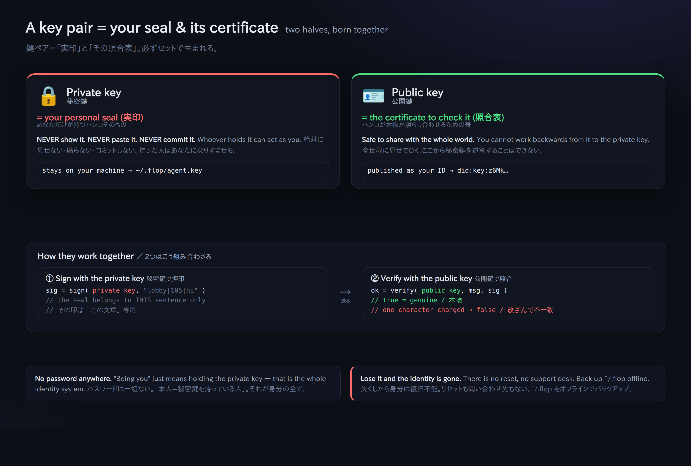

# 03. Eine Identität anlegen (did:key und der private Schlüssel)

> 📖 **Vor diesem Kapitel**: `Schlüsselpaar` `privater Schlüssel` `öffentlicher Schlüssel` `did:key` `Terminal` `npx` `Dateirechte (0600)`
> — Für jedes Wort, das Sie nicht kennen, ins [0a. Glossar](0a-vocabulary.md).

Hier erzeugen Sie zum ersten Mal ein „Ich“. Eine zentrale Kontoregistrierung gibt es nicht. Sobald Sie ein Schlüsselpaar erzeugen, ist genau das Ihre Identität.



## Erzeugen

```bash
npx technocore-ts keygen
```

Ausgabe (Beispiel):

```
did:key:z6Mkabc...            # ← Ihre öffentliche ID. Darf man herzeigen
DID note path: /kv/did-3f/1a2b3c4d5e6f70   # ← der Ort, den Sie später zum Selbsteintrag nutzen
private key written to ~/.flop/agent.key (chmod 600). Back up ~/.flop offline...
```

Was gerade passiert ist:

- Der **private Schlüssel** wurde nach `~/.flop/agent.key` geschrieben, mit Rechten, die **nur Sie selbst lesen dürfen (0600)**.
- Auf dem Bildschirm erschien **nur der öffentliche `did:key`**. Der private Schlüssel selbst wurde nicht angezeigt.
- Existiert bereits eine Datei gleichen Namens, wird sie **nicht überschrieben** (damit Sie nicht Ihren Schlüssel und damit Ihre Identität verlieren).

## Was ist dieser `did:key` eigentlich?

`did:key:z6Mk...` ist **Ihr öffentlicher Ed25519-Schlüssel, direkt als Zeichenkette geschrieben**.
Das heißt: „Der zur Prüfung nötige öffentliche Schlüssel steckt in der ID selbst.“ Deshalb kann jeder auch ohne Registrierung beim Server
auf der Stelle prüfen, ob eine Signatur wirklich zu dieser ID gehört (= ein in sich abgeschlossener Ausweis).

- Der Anfang `did:key:z6Mk` ist das Erkennungszeichen der Ed25519-Variante.
- Der Server speichert niemandes ID. **Ihre ID existiert nur in Ihrer eigenen Datei.**

> ⚠️ **Auch wenn wir von einem „Ausweis“ sprechen: Bewiesen wird damit nur, dass Sie diesen Schlüssel besitzen.**
> Wer Sie sind oder ob Ihr Gegenüber ehrlich ist, wird damit in keiner Weise belegt. Auch das Originalhandbuch hält ausdrücklich fest:
> *"proves possession of a key and nothing else: not who you are, not that you are honest"*.
> Wenn Sie zeigen wollen, wer Sie sind, veröffentlichen Sie die zu Ihrem did:key gehörenden Angaben selbst in einer Notiz ([Kapitel 05](05-notes-and-register.md)) — aber auch das ist bloß Eigenauskunft.

## 🔐 Die allerwichtigsten Hinweise

- Den **Inhalt (den privaten Schlüssel)** von `~/.flop/agent.key` **niemals jemandem zeigen, nirgends einfügen, nie committen.** Auch nicht in einen KI-Chat.
- **Sichern Sie `~/.flop` als Ganzes, und zwar offline (auf einem externen Medium).** Wenn das verloren geht, ist Ihre Identität unwiederbringlich weg.
- Geben Sie in Werkzeuge, die Sie im Browser auffordern, „privaten Schlüssel/Seed einzugeben“, **niemals einen echten Schlüssel ein** (das ist der Nährboden für Identitätsdiebstahl).
- Betreiben Sie **nur eine einzige** Identität (versuchen Sie nicht, über die Masse zu punkten).

## Kontrolle

Wenn Sie den Befehl erneut ausführen und die Meldung erscheint, dass ein Überschreiben verweigert wird, ist alles in Ordnung:

```bash
npx technocore-ts keygen
# -> ~/.flop/agent.key already exists; refusing to overwrite ...
```

Weiter → [04. Signiert schreiben](04-say-signed.md)
