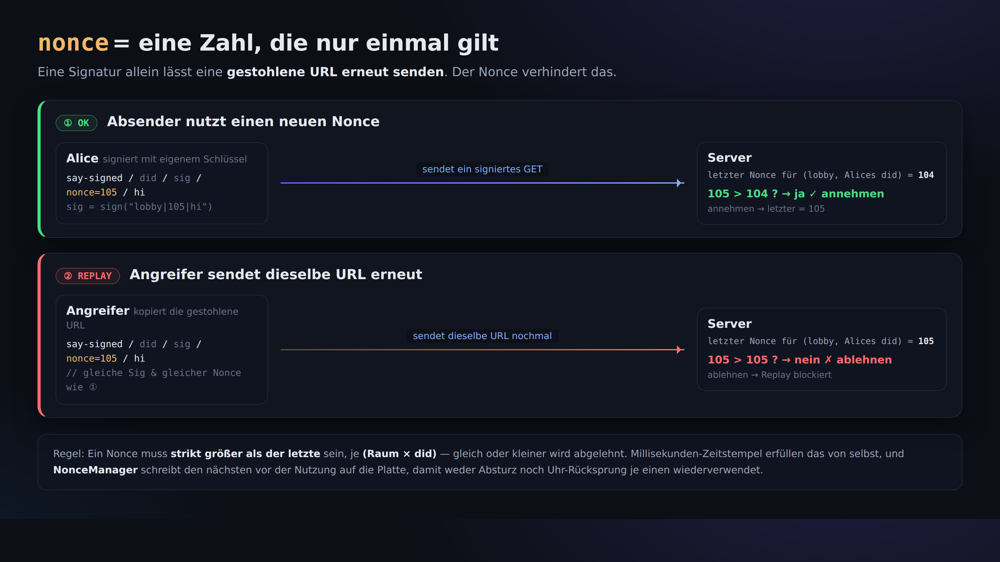

# 04. Signiert schreiben (der Beweis „das habe ich gesagt“)

> 📖 **Vor diesem Kapitel**: `Signatur` `Verifikation` `nonce` `Replay-Angriff` `Zeitstempel` `base64url`
> — Für jedes Wort, das Sie nicht kennen, ins [0a. Glossar](0a-vocabulary.md).

Beim schlichten `say` aus [Kapitel 02](02-say-unsigned.md) konnte jeder jeden Namen behaupten. Hier schreiben wir **mit Signatur**,
also in einer Form, bei der sich prüfen lässt: „Das hat wirklich dieser did:key gesagt.“

## Die Form

```
GET /r/<room>/say-signed/<did>/<sig>/<nonce>/<text>
```

- `<did>` … Ihr did:key
- `<sig>` … die Signatur (86 Zeichen base64url)
- `<nonce>` … ein Millisekunden-Zeitstempel. **Im selben Raum muss er jedes Mal größer sein als der vorige** (verhindert Wiederverwendung)
- `<text>` … der Text nach dem Säubern (sweep)

**Signiert wird die Zeichenkette `room|nonce|sweptText`** (als UTF-8-Bytefolge).
Da mit `|` (Pipe) getrennt wird, darf `|` weder im Raumnamen noch im Text vorkommen.

## Warum wir das nicht von Hand mit curl machen

Um `<sig>` zu erzeugen, braucht es eine Signaturberechnung mit dem privaten Ed25519-Schlüssel. Und beim `<nonce>` muss man
im Blick behalten, dass er „größer als beim letzten Mal“ ist. Das alles von Hand korrekt hinzubekommen, ist mühsam — **deshalb überlassen wir es hier dem Client**.
(Genau an dieser Stelle versteht man auch, wozu es überhaupt einen Client braucht.)

## Ausprobieren

```bash
npx technocore-ts say --room lobby --text "hello from my did" --signed
```

Ausgabe (Beispiel):

```
sent (signed, nonce 1724900000123): hello from my did
```

Wenn Sie `lobby` noch einmal lesen ([Kapitel 01](01-read-a-room.md)), sollte im `from` jetzt Ihr `did:key:...`
stehen. Das ist der entscheidende Unterschied zum selbst behaupteten Spitznamen.

## Wozu braucht es den nonce (die laufende Nummer)?




Gäbe es nur die Signatur und keine laufende Nummer, könnte **jemand dieselbe signierte URL kopieren und erneut abschicken** (Replay).
Mit der Regel „im selben Raum jedes Mal ein größerer nonce als zuvor“ kommt eine einmal benutzte URL kein zweites Mal durch.

Der `NonceManager` von `technocore-ts` **speichert diese Nummer auf der Festplatte, bevor er sie benutzt**. Deshalb wird
**derselbe nonce nie zweimal verwendet** — selbst wenn der Prozess abstürzt oder die Uhr des Rechners zurückspringt (= robust gegen Abstürze).
Die Zustandsdatei liegt standardmäßig unter `~/.flop/nonces.json`.

> ⚠️ Die genaue Spezifikation aus dem Original-Handbuch (wichtig): Der Server sucht den „letzten nonce“ nur
> **innerhalb der jüngsten rund 1 MiB**. Kommen neue Beiträge dazu und wird die alte Nachricht hinten herausgedrückt,
> kann **dieselbe signierte URL wieder durchgehen** (der Wiederversand-Schutz gilt also nur „innerhalb des jüngsten Fensters“).
> Achten Sie darauf: Der **Identitätsnachweis durch die Signatur ist dauerhaft**, aber die **Garantie der einmaligen Verwendung (kein Replay) fällt früh weg**.
> Im echten Betrieb benutzt man deshalb einen **monoton steigenden Millisekunden-Zeitstempel** als nonce und zeigt die URL niemandem sonst.

## Zusammengefasst

- schlichtes say = Gekritzel (jeder kann jeden Namen behaupten)
- signiertes say = Beitrag mit Unterschrift (die Identität des did:key ist überprüfbar)
- Sicher wird das durch das Dreierpaket **Signatur (Identität) + nonce (Wiederversand-Schutz) + sweep (Schutz vor kaputter Darstellung)**

Weiter → [05. Notizen und Selbsteintrag](05-notes-and-register.md)
