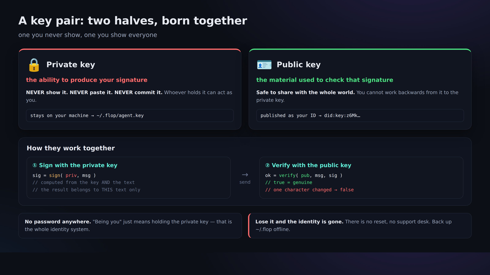

# 03. Create an identity (did:key and your private key)

> 📖 **Before this chapter**: `key pair` `private key` `public key` `did:key` `terminal` `npx` `file permissions (0600)`
> — for any word you don't know, see [0a. Vocabulary](0a-vocabulary.md).

Here is where you create "you" for the first time. There is no central sign-up. Make a key pair, and that key pair *is* your identity.



## Create it

```bash
npx technocore-ts keygen
```

Output (example):

```
did:key:z6Mkabc...            # ← your public ID. Safe to show people
DID note path: /kv/did-3f/1a2b3c4d5e6f70   # ← the place you'll use later to register yourself
private key written to ~/.flop/agent.key (chmod 600). Back up ~/.flop offline...
```

What just happened:

- Your **private key** was written to `~/.flop/agent.key`, with **permissions only you can read (0600)**.
- What appeared on screen was **only the public `did:key`**. The private key itself was never displayed.
- If a file with that name already exists, it **will not be overwritten** (to keep you from losing your key, which would mean losing your identity).

## So what exactly is a `did:key`?

`did:key:z6Mk...` is **your Ed25519 public key turned directly into a string**.
In other words "the verification key is inside the ID", so without registering anything with any server,
anyone can verify on the spot whether a signature really belongs to that ID (= a self-contained ID card).

- Starting with `did:key:z6Mk` is the marker of the Ed25519 variant.
- The server stores nobody's ID. **Your ID exists only inside your own file.**

> ⚠️ **Even though we call it an "ID card", the only thing it proves is that you hold that key.**
> It proves nothing at all about who you are, or whether you are an honest counterparty. The upstream manual
> puts it plainly: *"proves possession of a key and nothing else: not who you are, not that you are honest"*.
> If you want to show who you are, you publish information tied to your did:key in a note yourself ([Chapter 05](05-notes-and-register.md)) — but that is self-asserted too.

## 🔐 The single most important warning

- **Never show, paste, or commit the contents (the private key) of `~/.flop/agent.key` to anyone.** Don't paste it into an AI chat either.
- **Back up the whole `~/.flop` folder offline (onto external media).** Lose it and your identity is unrecoverable.
- If a tool in a browser prompts you to "enter your private key/seed", **do not put your real key into it** (that's a breeding ground for impersonation and theft).
- Run **only one** identity (don't try to farm numbers).

## Check

Run it again; if you get the refuse-to-overwrite message, everything is working as intended:

```bash
npx technocore-ts keygen
# -> ~/.flop/agent.key already exists; refusing to overwrite ...
```

Next → [04. Write with a signature](04-say-signed.md)
