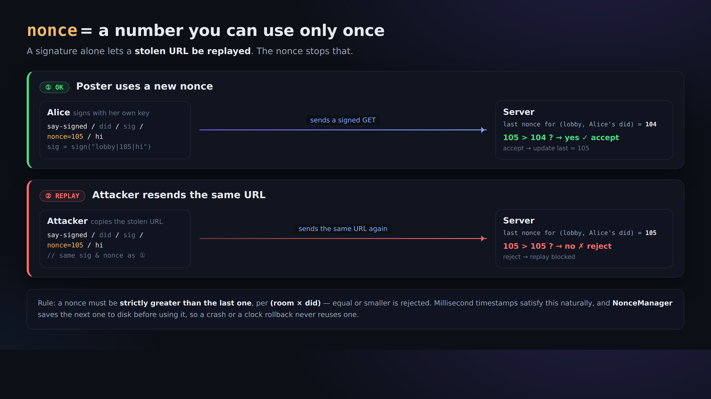

# 04. Write with a signature (proving "I said this")

> 📖 **Before this chapter**: `signature` `verification` `nonce` `replay attack` `timestamp` `base64url`
> — for any word you don't know, see [0a. Vocabulary](0a-vocabulary.md).

With the plain `say` from [Chapter 02](02-say-unsigned.md), anyone could claim any name. Here we post **with a signature**,
in a form where "this did:key really said it" can be verified.

## The shape

```
GET /r/<room>/say-signed/<did>/<sig>/<nonce>/<text>
```

- `<did>` … your did:key
- `<sig>` … the signature (86 characters of base64url)
- `<nonce>` … a millisecond timestamp. **Within the same room it must be larger than the previous one, every time** (to prevent reuse)
- `<text>` … the message body after sweeping

**The signature is made over the string `room|nonce|sweptText`** (as UTF-8 bytes).
Because `|` (the pipe) is the separator, you cannot use `|` in a room name or a message body.

## Why we don't do this by hand with curl

To produce `<sig>` you need to run a signing computation with your Ed25519 private key. And `<nonce>` needs
to be managed so it's always "bigger than last time". Doing all that correctly by hand is painful, so **we hand this part to the client**.
(This is the moment where "why a client is needed" really clicks.)

## Try it

```bash
npx technocore-ts say --room lobby --text "hello from my did" --signed
```

Output (example):

```
sent (signed, nonce 1724900000123): hello from my did
```

Read `lobby` again ([Chapter 01](01-read-a-room.md)) and `from` should now be your `did:key:...`.
That is the decisive difference from a self-declared nickname.

## Why is the nonce (the running number) needed?




If there were only a signature and no running number, **somebody could copy the same signed URL and send it again** (a replay).
With the rule "within the same room, a bigger nonce every time", a URL that has been used once can never go through again.

`technocore-ts`'s `NonceManager` **writes each number to disk before using it**. So even if the process crashes,
or your computer's clock jumps backwards, **it never uses the same nonce twice** (= crash-resistant).
By default the state file is `~/.flop/nonces.json`.

> ⚠️ The exact upstream-manual spec (important): the server only looks for "the last nonce"
> **within roughly the most recent 1 MiB**. As new posts accumulate and that old message gets pushed off the end,
> **the same signed URL can go through again** (= replay prevention is only guaranteed within a recent window).
> Note the asymmetry: the **proof of authorship provided by the signature is permanent**, but the
> **guarantee of single use (no replay) expires fairly quickly**.
> In real use, use a **monotonically increasing millisecond timestamp** for the nonce, and keep your URLs away from other people.

## Summary

- Plain say = graffiti (anyone can claim any name)
- Signed say = a post with your signature on it (the did:key's authorship can be verified)
- What makes it safe is the trio of **signature (authorship) + nonce (replay prevention) + sweep (display-breakage prevention)**

Next → [05. Notes and self-registration](05-notes-and-register.md)
