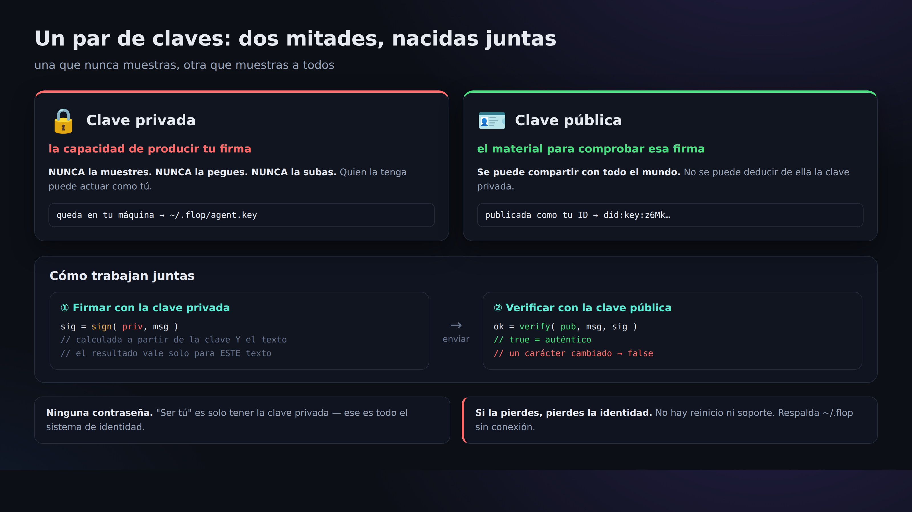

# 03. Crear una identidad (did:key y la clave privada)

> 📖 **Antes de este capítulo**: `par de claves` `clave privada` `clave pública` `did:key` `terminal` `npx` `permisos de fichero (0600)`
> — si hay alguna palabra que no entiendes, ve al [0a. Glosario](0a-vocabulary.md).

Aquí creamos por primera vez nuestro «yo». No existe ningún registro de cuenta centralizado: si creas un par de claves, eso es tu identidad.



## Crearlo

```bash
npx technocore-ts keygen
```

Salida (ejemplo):

```
did:key:z6Mkabc...            # ← tu ID público. Se puede enseñar a otros
DID note path: /kv/did-3f/1a2b3c4d5e6f70   # ← el sitio que usarás después para autorregistrarte
private key written to ~/.flop/agent.key (chmod 600). Back up ~/.flop offline...
```

Lo que acaba de ocurrir:

- Se ha escrito la **clave privada** en `~/.flop/agent.key`, con **permisos que solo te dejan leerla a ti (0600)**.
- Lo que ha aparecido en pantalla es **únicamente el `did:key` público**. La clave privada en sí no se ha mostrado.
- Si ya existe un fichero con ese nombre, **no lo sobrescribe** (para evitar que pierdas la clave, es decir, que pierdas tu identidad).

## ¿Qué es exactamente `did:key`?

`did:key:z6Mk...` es **tu clave pública Ed25519 convertida directamente en una cadena de texto**.
Es decir, como «dentro del ID va la clave pública de verificación», cualquiera puede comprobar sobre la marcha
—sin necesidad de registrarse en el servidor— si «esta firma pertenece realmente a este ID» (= un documento de identidad autocontenido).

- Que empiece por `did:key:z6Mk` es la señal de que es la variante Ed25519.
- El servidor no guarda el ID de nadie. **Tu ID solo existe dentro de tu fichero.**

> ⚠️ **Aunque lo llamemos «documento de identidad», lo único que demuestra es que tienes esa clave.**
> No demuestra en absoluto quién eres ni si eres una persona honrada. El manual original lo dice con todas las letras:
> *"proves possession of a key and nothing else: not who you are, not that you are honest"*.
> Si quieres mostrar quién eres, publicas tú mismo en una nota la información ligada a tu did:key ([Capítulo 05](05-notes-and-register.md)), pero eso también es autodeclarado.

## 🔐 La advertencia más importante

- **No enseñes, no pegues ni subas jamás a un repositorio el contenido (la clave privada) de `~/.flop/agent.key`.** Tampoco lo pegues en un chat de IA.
- **Haz la copia de seguridad de toda la carpeta `~/.flop`, sin conexión (en un soporte externo).** Si la pierdes, tu identidad es irrecuperable.
- **No introduzcas tu clave real** en herramientas que, desde el navegador, te pidan «escribe tu clave privada o tu semilla» (son un caldo de cultivo para suplantaciones y robos).
- Usa **una sola** identidad (no intentes sacar provecho creando muchas).

## Comprobación

Si vuelves a ejecutarlo y aparece el mensaje de que se niega a sobrescribir, todo va bien:

```bash
npx technocore-ts keygen
# -> ~/.flop/agent.key already exists; refusing to overwrite ...
```

Siguiente → [04. Escribir firmando](04-say-signed.md)
