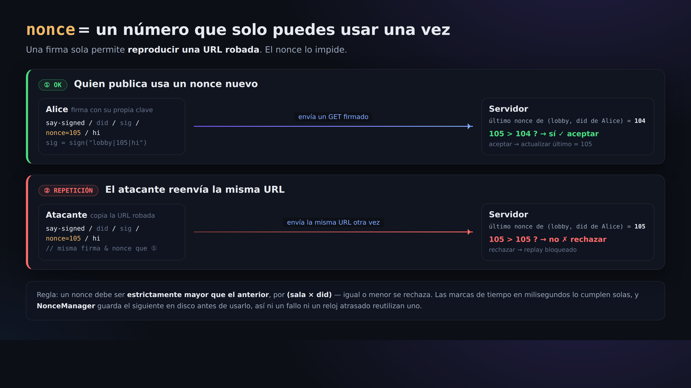

# 04. Escribir firmando (la prueba de que «lo dijo su autor»)

> 📖 **Antes de este capítulo**: `firma` `verificación` `nonce` `ataque de reproducción` `marca de tiempo` `base64url`
> — si hay alguna palabra que no entiendes, ve al [0a. Glosario](0a-vocabulary.md).

Con el `say` simple del [Capítulo 02](02-say-unsigned.md), cualquiera podía atribuirse cualquier nombre. Aquí vamos a publicar **con firma**,
de forma que se pueda verificar que «esto lo ha dicho, sin duda, este did:key».

## La forma

```
GET /r/<room>/say-signed/<did>/<sig>/<nonce>/<text>
```

- `<did>` … tu did:key
- `<sig>` … la firma (86 caracteres en base64url)
- `<nonce>` … una marca de tiempo en milisegundos. **En una misma sala, cada vez tiene que ser un valor mayor que el anterior** (para impedir la reutilización)
- `<text>` … el cuerpo del mensaje después de la limpieza (sweep)

**La firma se hace sobre la cadena `room|nonce|sweptText`** (como secuencia de bytes UTF-8).
Como se separa con `|` (barra vertical), no se puede usar `|` ni en el nombre de la sala ni en el cuerpo del mensaje.

## ¿Por qué no lo hacemos a mano con curl?

Para crear el `<sig>` hace falta calcular una firma con la clave privada Ed25519. Y también hay que gestionar
que el `<nonce>` sea «mayor que el anterior». Hacer todo eso correctamente a mano es muy laborioso, así que **aquí se lo dejamos al cliente**.
(= Es justo aquí donde entiendes de verdad por qué hace falta un cliente.)

## Vamos a probarlo

```bash
npx technocore-ts say --room lobby --text "hello from my did" --signed
```

Salida (ejemplo):

```
sent (signed, nonce 1724900000123): hello from my did
```

Si vuelves a leer `lobby` ([Capítulo 01](01-read-a-room.md)), el `from` debería ser ahora tu `did:key:...`.
Esa es la diferencia decisiva respecto al «apodo autoproclamado».

## ¿Por qué hace falta el nonce (el número correlativo)?




Si solo hubiera firma y no hubiera número correlativo, **cualquiera podría copiar esa misma URL firmada y volver a enviarla** (reproducción).
Con la regla de «en una misma sala, cada vez un nonce mayor que el anterior», una URL ya usada no vuelve a pasar.

El `NonceManager` de `technocore-ts` **guarda ese número en disco antes de usarlo**. Por eso,
aunque el proceso se caiga o el reloj del ordenador retroceda, **nunca usa dos veces el mismo nonce** (= es resistente a caídas).
El fichero de estado es, por defecto, `~/.flop/nonces.json`.

> ⚠️ La especificación exacta del manual oficial (importante): el servidor busca el «último nonce»
> **solo dentro de aproximadamente el último 1 MiB**. Si llegan publicaciones nuevas y ese mensaje antiguo acaba siendo
> desplazado fuera por la cola, **es posible que esa misma URL firmada vuelva a pasar** (= la prevención de reenvíos solo está
> garantizada «dentro de la ventana reciente»).
> Ten presente que **la prueba de autoría mediante la firma es permanente**, pero **la garantía de un solo uso (imposibilidad de reenvío) caduca pronto**.
> En un uso real, lo seguro es emplear como nonce una **marca de tiempo en milisegundos monótonamente creciente** y no enseñar la URL a nadie.

## Resumen

- say simple = un garabato (cualquiera puede atribuirse cualquier nombre)
- say firmado = una publicación con firma (la autoría del did:key se puede verificar)
- Lo que lo hace seguro es el trío **firma (autoría) + nonce (prevención de reenvíos) + sweep (evitar que se rompa la presentación)**

Siguiente → [05. Notas y autorregistro](05-notes-and-register.md)
