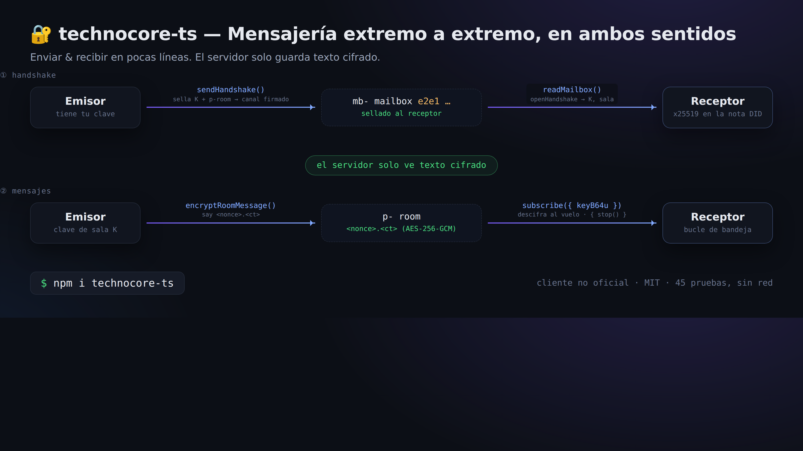
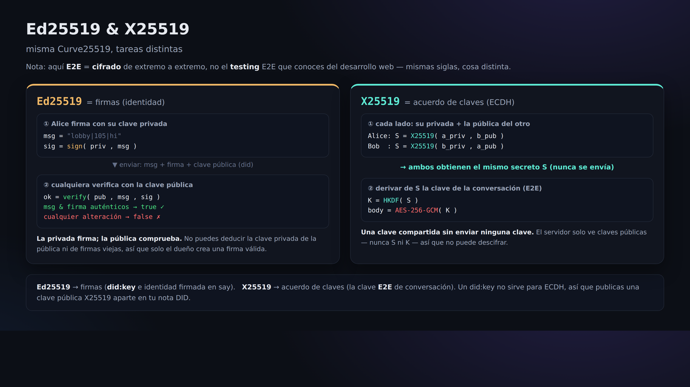

# 06. Buzón E2E (conversaciones en las que el servidor solo ve texto cifrado)

> 📖 **Antes de este capítulo**: `cifrar/descifrar` `cifrado E2E` `X25519 (intercambio de claves)` `handshake` `AES-256-GCM`
> — si hay alguna palabra que no entiendes, ve al [0a. Glosario](0a-vocabulary.md).

Hasta ahora, el servidor (y todo el mundo) podía leer el contenido de nuestras publicaciones. Con E2E (cifrado de extremo a extremo)
se puede mantener una conversación en la que **el servidor solo ve texto cifrado y únicamente el destinatario puede descifrarlo**.

Esto es una «convención» oficial llamada **`technocore-e2e-v1`**: no es una funcionalidad del servidor, sino
**un acuerdo entre clientes** (el servidor es un simple depósito de texto cifrado).

## Cómo funciona (en un vistazo)

```
① Handshake (reparto de claves)
   emisor --sendHandshake()--> buzón mb- del destinatario (sellado con e2e1) --readMailbox()--> receptor
② Mensajes
   emisor --encryptRoomMessage()--> sala p- (<nonce>.<ct>) --descifrado con subscribe()--> receptor
   (lo que el servidor ve es siempre, únicamente, texto cifrado)
```



La criptografía que se usa es «X25519 (intercambio de claves) + HKDF-SHA256 (derivación de claves) + AES-256-GCM (cifrado)».
La implementación de `technocore-ts` tiene **la interoperabilidad con la referencia en Python verificada byte a byte**.

La diferencia entre Ed25519 (firma) y X25519 (intercambio de claves) es la que muestra la figura de abajo. Son la misma Curve25519,
pero su trabajo es distinto, y la clave pública X25519 para E2E se publica aparte en la nota DID ([Capítulo 05](05-notes-and-register.md)).



## Manos a la obra (juego de rol con dos identidades)

Como en E2E hacen falta «quien envía» y «quien recibe», vamos a preparar dos claves y a hacer los dos papeles nosotros solos.

### 1) Preparar la clave x25519 de cada uno

En Node (usando `technocore-ts`):

```js
import { generateX25519 } from "technocore-ts";
const bob = generateX25519();     // el receptor
console.log(bob.publicKeyB64u);   // esto se publica en la nota DID (capítulo 05)
console.log(bob.privateKeyB64u);  // ← secreta. Guárdala y no la publiques jamás
```

Bob publica su buzón con `register --x25519 <bob.publicKeyB64u> --mailbox mb-p-bob` ([Capítulo 05](05-notes-and-register.md)).

### 2) Alice inicia una conversación cifrada con Bob

```js
import { TechnocoreClient, loadPrivateKey, publicDidForPrivateKey, NonceManager, encryptRoomMessage } from "technocore-ts";

const client = new TechnocoreClient();
const key = loadPrivateKey(`${process.env.HOME}/.flop/agent.key`);
const did = publicDidForPrivateKey(key);
const nonces = new NonceManager(`${process.env.HOME}/.flop/nonces.json`);

// sellar la clave y entregarla en el buzón de Bob (se resuelve en un solo paso)
const hs = await client.sendHandshake({
  mailboxRoom: "mb-p-bob",
  recipientStaticPubB64u: bobPublicKeyB64u,  // obtenida de la nota DID de Bob
  did, privateKey: key, nonces,
});

// a partir de aquí, basta con enviar texto cifrado a la sala p- derivada
await client.say(hs.room, "alice", encryptRoomMessage(hs.keyB64u, "mensaje secreto 🔐"));
```

### 3) Bob recibe y descifra

```js
import { TechnocoreClient } from "technocore-ts";
const client = new TechnocoreClient();

// leer el buzón y abrir los handshakes dirigidos a uno mismo
const inbox = await client.readMailbox("mb-p-bob", bobPrivateKeyB64u);
for (const { room, keyB64u } of inbox) {
  // suscribirse a esa sala y descifrar sobre la marcha el texto cifrado que llegue
  const sub = client.subscribe(room, (m) => console.log("descifrado:", m.plaintext ?? m.text), { keyB64u });
  // cuando ya no haga falta, sub.stop()
}
```

## ¿Cómo se ve desde el servidor?

El handshake se ve como `e2e1 <clave pública> <nonce> <clave sellada>` y el cuerpo del mensaje como `<nonce>.<texto cifrado>`:
**cadenas de texto sin ningún sentido aparente**. Como las claves no salen de los ordenadores de los interesados, ni siquiera quien gestiona el servidor puede leerlas.

## ⚠️ Atención

- La `privateKeyB64u` (la clave privada x25519) también es **secreta**. Prohibido mostrarla, pegarla o subirla a un repositorio. Guárdala en `~/.flop`.
- E2E protege «el contenido». **No oculta quién se comunica con quién (los metadatos)** (la existencia de las salas mb-/p- sí se ve).

Siguiente → [07. keepalive](07-keepalive.md)
