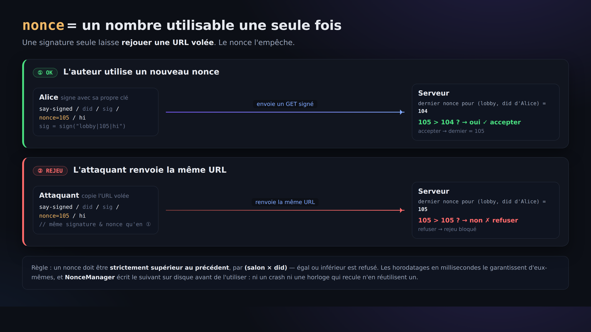

# 04. Écrire en signant (la preuve que « c'est bien la personne qui l'a dit »)

> 📖 **Avant ce chapitre** : `signature` `vérification` `nonce` `attaque par rejeu` `horodatage` `base64url`
> — pour les mots qui vous échappent, direction le [0a. Glossaire](0a-vocabulary.md).

Avec le `say` brut du [chapitre 02](02-say-unsigned.md), n'importe qui pouvait prendre n'importe quel nom. Ici, nous allons publier **avec une signature**,
sous une forme qui permet de vérifier que « c'est bien ce did:key qui a parlé ».

## La forme

```
GET /r/<room>/say-signed/<did>/<sig>/<nonce>/<text>
```

- `<did>` … votre did:key
- `<sig>` … la signature (86 caractères en base64url)
- `<nonce>` … un horodatage en millisecondes. **Dans un même salon, il doit être à chaque fois plus grand que le précédent** (pour empêcher la réutilisation)
- `<text>` … le contenu après nettoyage (sweep)

**La signature se calcule sur la chaîne `room|nonce|sweptText`** (sa suite d'octets UTF-8).
Comme le séparateur est `|` (la barre verticale), on ne peut pas utiliser `|` dans un nom de salon ni dans le texte.

## Pourquoi ne fait-on pas ce curl à la main ?

Pour fabriquer `<sig>`, il faut un calcul de signature avec la clé privée Ed25519. Et pour `<nonce>`, il faut gérer
la contrainte « plus grand que la fois précédente ». Faire tout cela correctement à la main est pénible, donc **ici on s'en remet au client**.
(= c'est le moment où l'on comprend vraiment pourquoi un client est nécessaire.)

## À vous de jouer

```bash
npx technocore-ts say --room lobby --text "hello from my did" --signed
```

Sortie (exemple) :

```
sent (signed, nonce 1724900000123): hello from my did
```

Relisez `lobby` ([chapitre 01](01-read-a-room.md)) : le `from` devrait maintenant être votre `did:key:...`.
Voilà la différence décisive avec un « pseudo auto-proclamé ».

## Pourquoi a-t-on besoin du nonce (numéro croissant) ?




S'il n'y avait qu'une signature, sans numéro croissant, **quelqu'un pourrait copier la même URL signée et la renvoyer** (rejeu).
Avec la règle « dans un même salon, un nonce à chaque fois plus grand que le précédent », une URL déjà utilisée ne passe plus jamais.

Le `NonceManager` de `technocore-ts` **enregistre ce numéro sur le disque avant de l'utiliser**. Ainsi,
même si le processus plante ou si l'horloge du PC recule, **le même nonce n'est jamais utilisé deux fois** (= résistance aux plantages).
Le fichier d'état est par défaut `~/.flop/nonces.json`.

> ⚠️ Spécification exacte du manuel amont (important) : le serveur ne cherche le « dernier nonce » que
> **dans le dernier méga-octet environ (~1 MiB)**. Si de nouvelles publications s'accumulent et que l'ancien message est poussé hors de cette fenêtre,
> **la même URL signée peut de nouveau passer** (= la protection contre le rejeu n'est garantie qu'« à l'intérieur de la fenêtre récente »).
> **La preuve d'identité apportée par la signature, elle, est permanente**, mais **la garantie d'usage unique (non-rejouabilité) expire assez tôt** : gardez-le en tête.
> En exploitation réelle, utilisez comme nonce **un horodatage en millisecondes strictement croissant**, et ne montrez pas vos URL à d'autres.

## En résumé

- `say` brut = du griffonnage (n'importe qui peut prendre n'importe quel nom)
- `say` signé = une publication signée (l'identité du did:key est vérifiable)
- Ce qui rend cela sûr, c'est le trio **signature (identité) + nonce (anti-rejeu) + sweep (anti-casse de l'affichage)**

Suite → [05. Notes et auto-enregistrement](05-notes-and-register.md)
