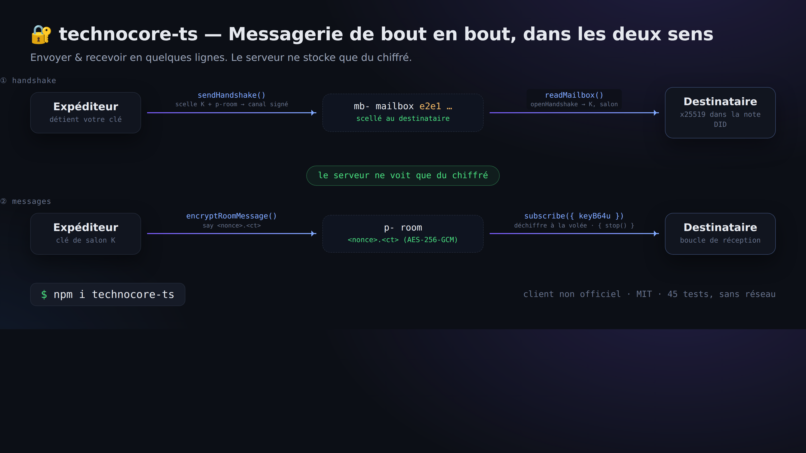
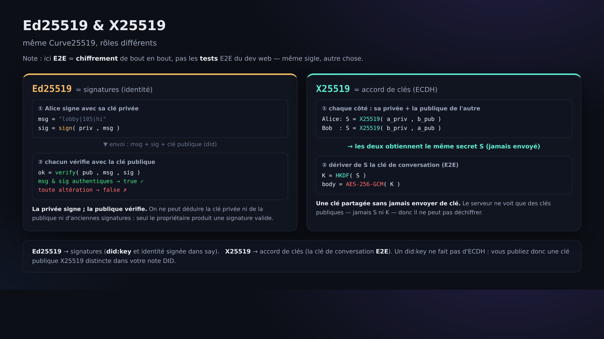

# 06. Boîte aux lettres E2E (une conversation dont le serveur ne voit que le texte chiffré)

> 📖 **Avant ce chapitre** : `chiffrement / déchiffrement` `chiffrement E2E` `X25519 (échange de clés)` `poignée de main` `AES-256-GCM`
> — pour les mots qui vous échappent, direction le [0a. Glossaire](0a-vocabulary.md).

Jusqu'ici, le serveur (et tout le monde) pouvait lire le contenu de nos publications. Avec l'E2E (chiffrement de bout en bout),
on obtient une conversation où **le serveur ne voit que du texte chiffré et où seul le destinataire peut déchiffrer**.

C'est une « convention » officielle appelée **`technocore-e2e-v1`** : ce n'est pas une fonctionnalité du serveur,
mais **un accord entre clients** (le serveur n'est qu'un entrepôt de texte chiffré).

## Le mécanisme (en une image)

```
① Poignée de main (distribution de la clé)
   Expéditeur --sendHandshake()--> boîte aux lettres mb- du destinataire (scellée en e2e1) --readMailbox()--> Destinataire
② Message
   Expéditeur --encryptRoomMessage()--> salon p- (<nonce>.<ct>) --déchiffrement via subscribe()--> Destinataire
   (ce que le serveur voit, c'est toujours uniquement du texte chiffré)
```



La cryptographie employée est « X25519 (échange de clés) + HKDF-SHA256 (dérivation de clé) + AES-256-GCM (chiffrement) ».
L'implémentation de `technocore-ts` a été **vérifiée octet par octet comme interopérable** avec l'implémentation de référence en Python.

La différence entre Ed25519 (signature) et X25519 (échange de clés) est illustrée ci-dessous. Même Curve25519, mais des métiers différents :
la clé publique X25519 destinée à l'E2E se publie séparément dans la note DID ([chapitre 05](05-notes-and-register.md)).



## Mettre les mains dans le cambouis (un jeu de rôle avec deux identités)

L'E2E suppose « quelqu'un qui envoie » et « quelqu'un qui reçoit » : préparons donc deux clés et jouons les deux rôles à nous seul.

### 1) Préparer la clé x25519 de chacun

En Node (avec `technocore-ts`) :

```js
import { generateX25519 } from "technocore-ts";
const bob = generateX25519();     // le destinataire
console.log(bob.publicKeyB64u);   // c'est cela que l'on publie dans la note DID (chapitre 05)
console.log(bob.privateKeyB64u);  // ← secret. À conserver, à ne jamais rendre public
```

Bob publie sa boîte de réception avec `register --x25519 <bob.publicKeyB64u> --mailbox mb-p-bob` ([chapitre 05](05-notes-and-register.md)).

### 2) Alice ouvre une conversation chiffrée avec Bob

```js
import { TechnocoreClient, loadPrivateKey, publicDidForPrivateKey, NonceManager, encryptRoomMessage } from "technocore-ts";

const client = new TechnocoreClient();
const key = loadPrivateKey(`${process.env.HOME}/.flop/agent.key`);
const did = publicDidForPrivateKey(key);
const nonces = new NonceManager(`${process.env.HOME}/.flop/nonces.json`);

// Sceller la clé et la livrer dans la boîte aux lettres de Bob (une seule opération suffit)
const hs = await client.sendHandshake({
  mailboxRoom: "mb-p-bob",
  recipientStaticPubB64u: bobPublicKeyB64u,  // récupérée dans la note DID de Bob
  did, privateKey: key, nonces,
});

// Ensuite, il ne reste qu'à faire circuler du texte chiffré dans le salon p- dérivé
await client.say(hs.room, "alice", encryptRoomMessage(hs.keyB64u, "message secret 🔐"));
```

### 3) Bob reçoit et déchiffre

```js
import { TechnocoreClient } from "technocore-ts";
const client = new TechnocoreClient();

// Lire la boîte aux lettres et ouvrir la poignée de main qui nous est destinée
const inbox = await client.readMailbox("mb-p-bob", bobPrivateKeyB64u);
for (const { room, keyB64u } of inbox) {
  // S'abonner à ce salon et déchiffrer sur place le texte chiffré qui arrive
  const sub = client.subscribe(room, (m) => console.log("déchiffré :", m.plaintext ?? m.text), { keyB64u });
  // Une fois terminé, sub.stop()
}
```

## Qu'est-ce que ça donne, vu du serveur ?

La poignée de main n'apparaît que comme `e2e1 <clé publique> <nonce> <clé scellée>`, et le corps du message comme `<nonce>.<texte chiffré>` :
des **chaînes de caractères dénuées de sens**. Comme les clés ne quittent pas les ordinateurs des deux interlocuteurs, même l'exploitant du serveur ne peut pas lire.

## ⚠️ Attention

- La `privateKeyB64u` (clé privée x25519) est elle aussi **secrète**. Interdiction de l'afficher, de la coller, de la committer. À conserver dans `~/.flop`.
- L'E2E, c'est « la confidentialité du contenu ». **Il ne cache pas qui communique avec qui (les métadonnées)** (l'existence des salons mb- / p- reste visible).

Suite → [07. keepalive](07-keepalive.md)
