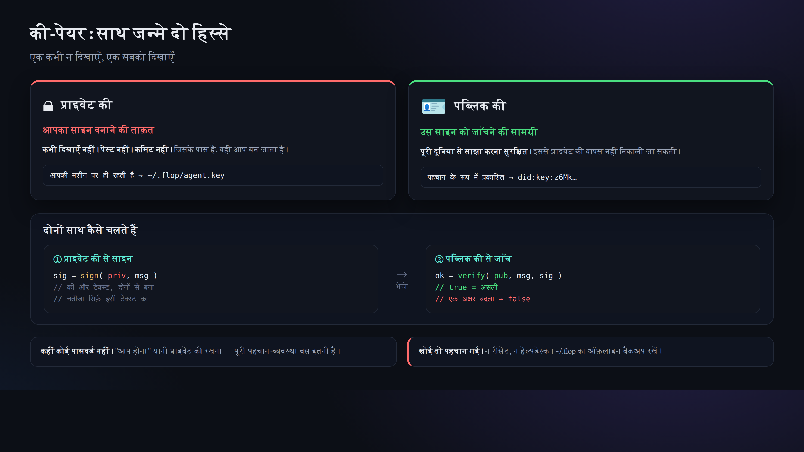

# 03. पहचान बनाना (did:key और निजी चाबी)

> 📖 **इस अध्याय से पहले**: `चाबी-जोड़ा` `निजी चाबी` `सार्वजनिक चाबी` `did:key` `टर्मिनल` `npx` `फ़ाइल की अनुमति(0600)`
> — जो शब्द समझ न आए, उसके लिए [0a. शब्दावली](0a-vocabulary.md) देखिए।

अब पहली बार हम "अपने आप" को बनाएँगे। कोई केंद्रीय अकाउंट रजिस्ट्रेशन नहीं है। चाबी-जोड़ा बना लीजिए, वही आपकी पहचान है।



## बनाना

```bash
npx technocore-ts keygen
```

आउटपुट (उदाहरण):

```
did:key:z6Mkabc...            # ← आपकी सार्वजनिक ID। इसे लोगों को दिखाया जा सकता है
DID note path: /kv/did-3f/1a2b3c4d5e6f70   # ← आगे अपना पंजीकरण करने की जगह
private key written to ~/.flop/agent.key (chmod 600). Back up ~/.flop offline...
```

जो हुआ, वह यह:

- **निजी चाबी** `~/.flop/agent.key` में, **सिर्फ़ आप ही पढ़ सकें ऐसी अनुमति (0600)** के साथ लिख दी गई।
- स्क्रीन पर जो दिखा, वह **सिर्फ़ सार्वजनिक `did:key` है**। निजी चाबी ख़ुद दिखाई नहीं गई।
- उसी नाम की फ़ाइल पहले से हो, तो उसे **ऊपर से नहीं लिखा जाता** (चाबी खोना = पहचान खोना, इसे रोकने के लिए)।

## आख़िर यह `did:key` है क्या?

`did:key:z6Mk...` दरअसल **आपकी Ed25519 सार्वजनिक चाबी को ज्यों का त्यों एक लाइन में बदल देने से बनता है**।
यानी "ID के भीतर ही सत्यापन के लिए ज़रूरी सार्वजनिक चाबी मौजूद है", इसलिए सर्वर पर पंजीकरण किए बिना भी
कोई भी वहीं-के-वहीं यह जाँच सकता है कि "यह हस्ताक्षर सचमुच इसी ID का है या नहीं" (यानी अपने आप में पूरा पहचान-पत्र)।

- `did:key:z6Mk` से शुरू होना, यही Ed25519 वाले रूप की निशानी है।
- सर्वर किसी की भी ID नहीं सँभालता। **आपकी ID सिर्फ़ आपकी फ़ाइल के अंदर** ही है।

> ⚠️ **"पहचान-पत्र" कहने भर से यह मत समझिए — इससे सिर्फ़ इतना ही साबित होता है कि "वह चाबी इसके पास है"।**
> आप हैं कौन, और सामने वाला ईमानदार है या नहीं — यह इससे बिलकुल भी साबित नहीं होता। मूल मैनुअल में भी
> *"proves possession of a key and nothing else: not who you are, not that you are honest"* साफ़-साफ़ लिखा है।
> आप कौन हैं यह बताना हो, तो did:key से जुड़ी जानकारी आपको ख़ुद नोट में सार्वजनिक करनी होगी ([अध्याय 05](05-notes-and-register.md)), पर वह भी सिर्फ़ आपका अपना दावा ही है।

## 🔐 सबसे ज़रूरी सावधानी

- `~/.flop/agent.key` की **सामग्री (निजी चाबी) कभी किसी को मत दिखाइए, कहीं मत चिपकाइए, कमिट मत कीजिए**। AI चैट में भी मत चिपकाइए।
- **बैकअप पूरे `~/.flop` का ही, ऑफ़लाइन (बाहरी मीडिया) में** लीजिए। यह खो गया तो पहचान वापस पाना नामुमकिन है।
- ब्राउज़र पर जो औज़ार "निजी चाबी / सीड डालिए" कहकर उकसाएँ, उनमें **असली चाबी मत डालिए** (रूप धरने और चोरी का अड्डा यही हैं)।
- पहचान **सिर्फ़ एक ही** चलाइए (संख्या बढ़ाकर कमाने की कोशिश मत कीजिए)।

## जाँच

एक बार फिर चलाइए, और अगर ऊपर से न लिखने वाला संदेश आए तो सब ठीक है:

```bash
npx technocore-ts keygen
# -> ~/.flop/agent.key already exists; refusing to overwrite ...
```

आगे → [04. हस्ताक्षर करके लिखना](04-say-signed.md)
