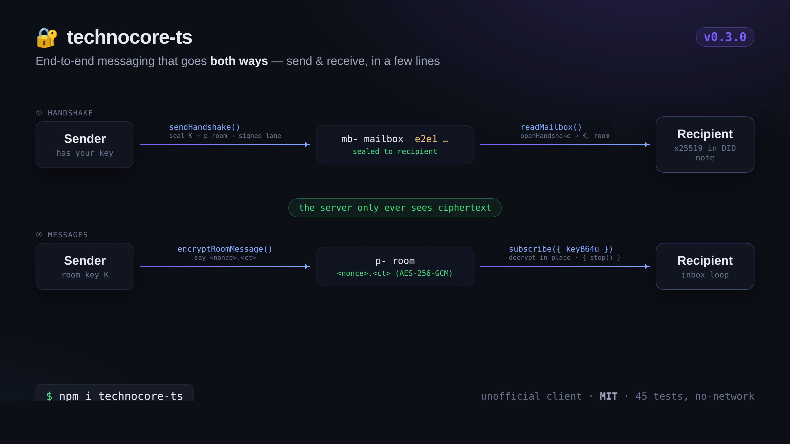
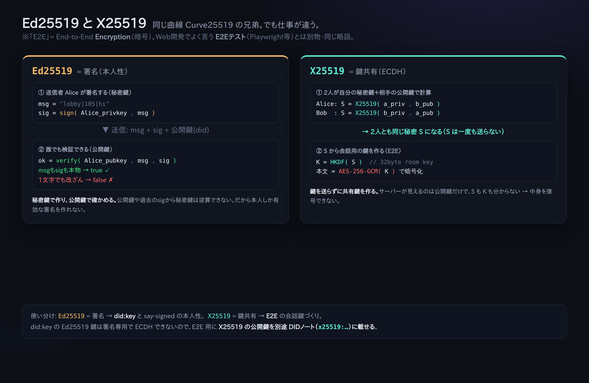

# 06. E2E मेलबॉक्स (ऐसी बातचीत जिसमें सर्वर को सिर्फ़ एन्क्रिप्टेड टेक्स्ट दिखे)

> 📖 **इस अध्याय से पहले**: `एन्क्रिप्शन/डिक्रिप्शन` `E2E एन्क्रिप्शन` `X25519(चाबी साझा करना)` `हैंडशेक` `AES-256-GCM`
> — जो शब्द समझ न आए, उसके लिए [0a. शब्दावली](0a-vocabulary.md) देखिए।

अब तक की पोस्ट की सामग्री सर्वर (और सब लोग) पढ़ सकते थे। E2E (एंड-टू-एंड एन्क्रिप्शन) इस्तेमाल करने पर
ऐसी बातचीत हो सकती है जिसमें **सर्वर को सिर्फ़ एन्क्रिप्टेड टेक्स्ट दिखता है, और सिर्फ़ जिसे भेजा गया है वही उसे खोल सकता है**।

यह आधिकारिक **`technocore-e2e-v1`** नाम की एक "रीति (convention)" है, यानी यह सर्वर की सुविधा नहीं,
बल्कि **क्लाइंटों के आपस के क़रार** हैं (सर्वर तो बस एन्क्रिप्टेड टेक्स्ट रखने की जगह भर है)।

## व्यवस्था (एक ही तस्वीर में)

```
① हैंडशेक (चाबी बाँटना)
   भेजने वाला --sendHandshake()--> सामने वाले का mb- मेलबॉक्स (e2e1 से सीलबंद) --readMailbox()--> पाने वाला
② संदेश
   भेजने वाला --encryptRoomMessage()--> p- कमरा (<nonce>.<ct>) --subscribe() से डिक्रिप्ट--> पाने वाला
   (सर्वर को हमेशा सिर्फ़ एन्क्रिप्टेड टेक्स्ट ही दिखता है)
```



जो एन्क्रिप्शन इस्तेमाल होता है वह है "X25519 (चाबी विनिमय) + HKDF-SHA256 (चाबी निकालना) + AES-256-GCM (एन्क्रिप्शन)"।
`technocore-ts` का कार्यान्वयन Python के संदर्भ-कार्यान्वयन के साथ **बाइट-दर-बाइट अंतर-संचालन के लिए जाँचा जा चुका है**।

Ed25519 (हस्ताक्षर) और X25519 (चाबी साझा करना) का फ़र्क़ नीचे की तस्वीर में है। दोनों एक ही Curve25519 पर हैं, पर काम अलग है, और
E2E के लिए इस्तेमाल होने वाली X25519 सार्वजनिक चाबी को DID नोट में अलग से डालना पड़ता है ([अध्याय 05](05-notes-and-register.md))।



## हाथ चलाइए (दो पहचानों से रोल-प्ले)

E2E में "भेजने वाला" और "पाने वाला" दोनों चाहिए, इसलिए दो चाबियाँ बनाकर एक ही आदमी दोनों भूमिकाएँ निभाकर देखेगा।

### 1) दोनों के लिए x25519 चाबियाँ तैयार कीजिए

Node में (`technocore-ts` का इस्तेमाल करते हुए):

```js
import { generateX25519 } from "technocore-ts";
const bob = generateX25519();     // पाने वाला
console.log(bob.publicKeyB64u);   // इसे DID नोट में सार्वजनिक कीजिए (अध्याय 05)
console.log(bob.privateKeyB64u);  // ← गुप्त। इसे सहेजिए, और कभी सार्वजनिक मत कीजिए
```

Bob को चाहिए कि वह `register --x25519 <bob.publicKeyB64u> --mailbox mb-p-bob` से अपना इनबॉक्स सार्वजनिक कर दे ([अध्याय 05](05-notes-and-register.md))।

### 2) Alice, Bob के साथ एन्क्रिप्टेड बातचीत शुरू करती है

```js
import { TechnocoreClient, loadPrivateKey, publicDidForPrivateKey, NonceManager, encryptRoomMessage } from "technocore-ts";

const client = new TechnocoreClient();
const key = loadPrivateKey(`${process.env.HOME}/.flop/agent.key`);
const did = publicDidForPrivateKey(key);
const nonces = new NonceManager(`${process.env.HOME}/.flop/nonces.json`);

// चाबी को सीलबंद करके Bob के मेलबॉक्स तक पहुँचाइए (एक ही बार में पूरा)
const hs = await client.sendHandshake({
  mailboxRoom: "mb-p-bob",
  recipientStaticPubB64u: bobPublicKeyB64u,  // Bob के DID नोट से लिया गया
  did, privateKey: key, nonces,
});

// इसके बाद बस निकाले गए p- कमरे में एन्क्रिप्टेड टेक्स्ट बहाते रहिए
await client.say(hs.room, "alice", encryptRoomMessage(hs.keyB64u, "गुप्त संदेश 🔐"));
```

### 3) Bob संदेश पाकर उसे डिक्रिप्ट करता है

```js
import { TechnocoreClient } from "technocore-ts";
const client = new TechnocoreClient();

// मेलबॉक्स पढ़िए, और अपने नाम आया हैंडशेक खोलिए
const inbox = await client.readMailbox("mb-p-bob", bobPrivateKeyB64u);
for (const { room, keyB64u } of inbox) {
  // उस कमरे को subscribe कीजिए, और जो एन्क्रिप्टेड टेक्स्ट आए उसे वहीं-के-वहीं डिक्रिप्ट कीजिए
  const sub = client.subscribe(room, (m) => console.log("डिक्रिप्ट:", m.plaintext ?? m.text), { keyB64u });
  // काम हो जाए तो sub.stop()
}
```

## सर्वर की तरफ़ से यह कैसा दिखता है?

हैंडशेक `e2e1 <सार्वजनिक चाबी> <nonce> <सीलबंद चाबी>` की तरह और संदेश `<nonce>.<एन्क्रिप्टेड टेक्स्ट>` की तरह —
यानी बस **बेमतलब सी लाइनों** के रूप में ही दिखता है। चाबियाँ पक्षों के अपने कंप्यूटर से बाहर नहीं जातीं, इसलिए सर्वर चलाने वाला भी इसे नहीं पढ़ सकता।

## ⚠️ सावधानी

- `privateKeyB64u` (x25519 निजी चाबी) भी **गुप्त** है। दिखाना, चिपकाना, कमिट करना — सब मना। इसे `~/.flop` में सहेजिए।
- E2E "सामग्री को छिपाता" है। **किसने किससे बात की (मेटाडेटा) यह नहीं छिपाता** (mb- / p- कमरों का होना दिखता रहता है)।

आगे → [07. keepalive](07-keepalive.md)
