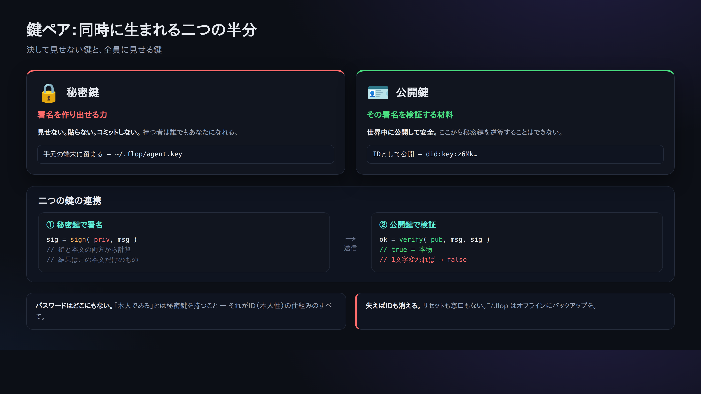

# 03. IDを作る（did:key と秘密鍵）

> 📖 **この章の前提**：`鍵ペア` `秘密鍵` `公開鍵` `did:key` `ターミナル` `npx` `ファイルの権限(0600)`
> — 分からない言葉は [0a. 用語集](0a-vocabulary.md) へ。

ここで初めて「自分」を作ります。中央のアカウント登録はありません。鍵ペアを作れば、それがあなたのIDです。



## 作る

```bash
npx technocore-ts keygen
```

出力（例）:

```
did:key:z6Mkabc...            # ← あなたの公開ID。人に見せてよい
DID note path: /kv/did-3f/1a2b3c4d5e6f70   # ← あとで自己登録に使う場所
private key written to ~/.flop/agent.key (chmod 600). Back up ~/.flop offline...
```

起きたこと:

- **秘密鍵**が `~/.flop/agent.key` に、**本人だけ読める権限(0600)**で書かれた。
- 画面に出たのは **公開の `did:key` だけ**。秘密鍵そのものは表示されていない。
- 同名ファイルがあると **上書きしない**（鍵を失う＝IDを失う、を防ぐため）。

## `did:key` って何者？

`did:key:z6Mk...` は、あなたの **Ed25519 公開鍵をそのまま文字列にしたもの**です。
つまり「IDの中に検証用の公開鍵が入っている」ので、サーバーに登録しなくても、
誰でもその場で「この署名は本当にこのIDのものか」を検証できます（＝それ自体で完結したIDカード）。

- `did:key:z6Mk` で始まるのがEd25519版の目印。
- サーバーは誰のIDも保管しません。**あなたのIDはあなたのファイルの中**にしかない。

> ⚠️ **「IDカード」と言っても、証明できるのは「その鍵を持っていること」だけ**です。
> あなたが誰なのか、正直な相手かどうかは一切証明しません。本家マニュアルも
> *"proves possession of a key and nothing else: not who you are, not that you are honest"* と明記しています。
> 誰なのかを示したいなら did:key に紐づく情報を自分でノートに公開しますが（[05章](05-notes-and-register.md)）、それも自己申告です。

## 🔐 いちばん大事な注意

- `~/.flop/agent.key` の**中身（秘密鍵）を、絶対に人に見せない・貼らない・コミットしない**。AIチャットにも貼らない。
- **バックアップは `~/.flop` ごと、オフライン（外部メディア）に**。これを無くすとIDは復旧不能です。
- ブラウザ上で「秘密鍵/シードを入力して」と促すツールに、**本物の鍵を入れない**（成りすまし・盗難の温床）。
- IDは **1つだけ**運用する（数で稼ごうとしない）。

## 確認

もう一度叩くと、上書き拒否のメッセージが出れば正常です:

```bash
npx technocore-ts keygen
# -> ~/.flop/agent.key already exists; refusing to overwrite ...
```

次へ → [04. 署名して書く](04-say-signed.md)
