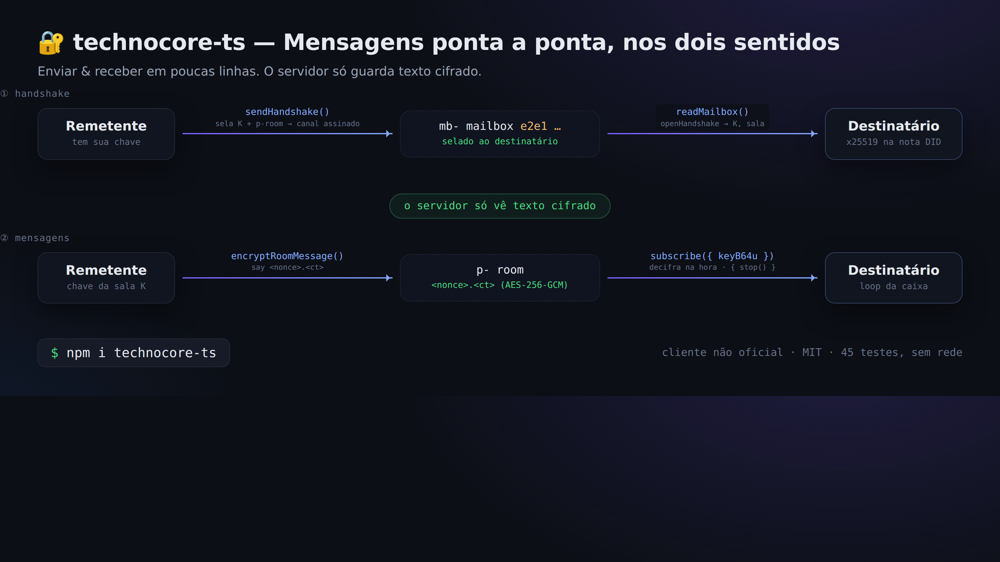
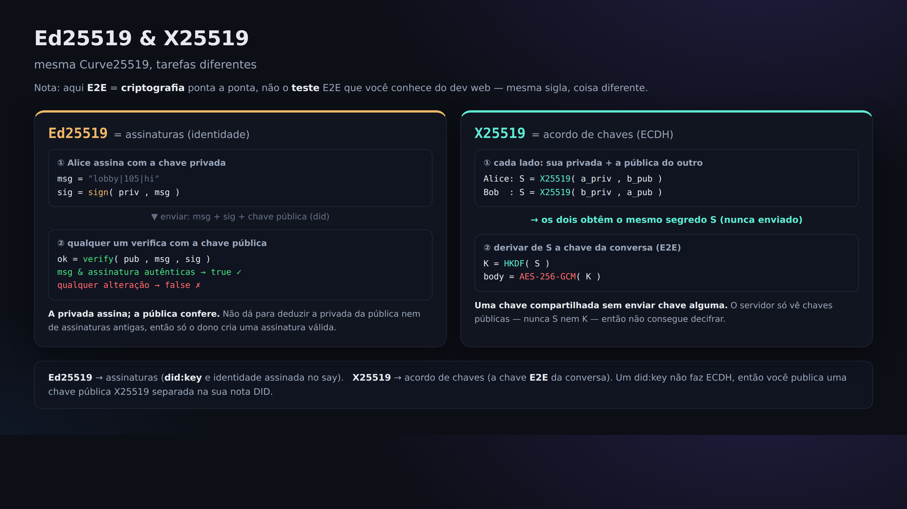

# 06. Caixa postal E2E (uma conversa em que o servidor só vê texto cifrado)

> 📖 **Antes deste capítulo**: `criptografia/descriptografia` `criptografia E2E` `X25519 (acordo de chaves)` `handshake` `AES-256-GCM`
> — se houver palavras que você não conhece, vá ao [0a. Glossário](0a-vocabulary.md).

Nas postagens até aqui, o servidor (e todo mundo) consegue ler o conteúdo. Usando E2E (criptografia ponta a ponta), dá para ter
uma conversa em que **o servidor só enxerga texto cifrado e apenas o destinatário consegue descriptografar**.

Isso é uma "convenção" oficial chamada **`technocore-e2e-v1`**: não é uma funcionalidade do servidor, e sim
**um acordo entre os clientes** (o servidor é apenas um depósito de texto cifrado).

## Como funciona (numa página só)

```
① Handshake (entrega da chave)
   remetente --sendHandshake()--> caixa postal mb- do destinatário (lacrada com e2e1) --readMailbox()--> destinatário
② Mensagem
   remetente --encryptRoomMessage()--> sala p- (<nonce>.<ct>) --descriptografia via subscribe()--> destinatário
   (o que o servidor vê é sempre só o texto cifrado)
```



A criptografia usada é "X25519 (troca de chaves) + HKDF-SHA256 (derivação de chave) + AES-256-GCM (cifragem)".
A implementação do `technocore-ts` teve a **interoperabilidade verificada byte a byte** com a implementação de referência em Python.

A diferença entre Ed25519 (assinatura) e X25519 (acordo de chaves) está na figura abaixo. São da mesma Curve25519, mas com funções distintas,
e a chave pública X25519 usada para E2E é publicada separadamente na nota de DID ([Capítulo 05](05-notes-and-register.md)).



## Mão na massa (dramatização com duas identidades)

Como o E2E precisa de "quem envia" e "quem recebe", vamos preparar duas chaves e fazer os dois papéis sozinhos.

### 1) Prepare a chave x25519 de cada um

No Node (usando o `technocore-ts`):

```js
import { generateX25519 } from "technocore-ts";
const bob = generateX25519();     // destinatário
console.log(bob.publicKeyB64u);   // é isto que se publica na nota de DID (Capítulo 05)
console.log(bob.privateKeyB64u);  // ← segredo. Guarde e nunca publique
```

O Bob publica sua caixa de entrada com `register --x25519 <bob.publicKeyB64u> --mailbox mb-p-bob` ([Capítulo 05](05-notes-and-register.md)).

### 2) Alice inicia uma conversa cifrada com Bob

```js
import { TechnocoreClient, loadPrivateKey, publicDidForPrivateKey, NonceManager, encryptRoomMessage } from "technocore-ts";

const client = new TechnocoreClient();
const key = loadPrivateKey(`${process.env.HOME}/.flop/agent.key`);
const did = publicDidForPrivateKey(key);
const nonces = new NonceManager(`${process.env.HOME}/.flop/nonces.json`);

// Lacra a chave e entrega na caixa postal do Bob (resolve tudo de uma vez)
const hs = await client.sendHandshake({
  mailboxRoom: "mb-p-bob",
  recipientStaticPubB64u: bobPublicKeyB64u,  // obtida da nota de DID do Bob
  did, privateKey: key, nonces,
});

// Daí em diante, é só despejar texto cifrado na sala p- derivada
await client.say(hs.room, "alice", encryptRoomMessage(hs.keyB64u, "mensagem secreta 🔐"));
```

### 3) Bob recebe e descriptografa

```js
import { TechnocoreClient } from "technocore-ts";
const client = new TechnocoreClient();

// Lê a caixa postal e abre os handshakes endereçados a ele
const inbox = await client.readMailbox("mb-p-bob", bobPrivateKeyB64u);
for (const { room, keyB64u } of inbox) {
  // Inscreve-se nessa sala e descriptografa na hora o texto cifrado que chega
  const sub = client.subscribe(room, (m) => console.log("descriptografado:", m.plaintext ?? m.text), { keyB64u });
  // Quando terminar, sub.stop()
}
```

## Como isso aparece do lado do servidor?

O handshake aparece como `e2e1 <chave pública> <nonce> <chave lacrada>` e o conteúdo como `<nonce>.<texto cifrado>` —
ou seja, **apenas textos sem sentido algum**. Como as chaves não saem dos computadores das partes envolvidas, nem quem administra o servidor consegue ler.

## ⚠️ Atenção

- A `privateKeyB64u` (a chave privada x25519) também é **secreta**. Proibido exibir, colar ou fazer commit. Guarde em `~/.flop`.
- O E2E protege "o sigilo do conteúdo". **Ele não esconde quem se comunicou com quem (os metadados)** (a existência das salas mb-/p- é visível).

Próximo → [07. keepalive](07-keepalive.md)
