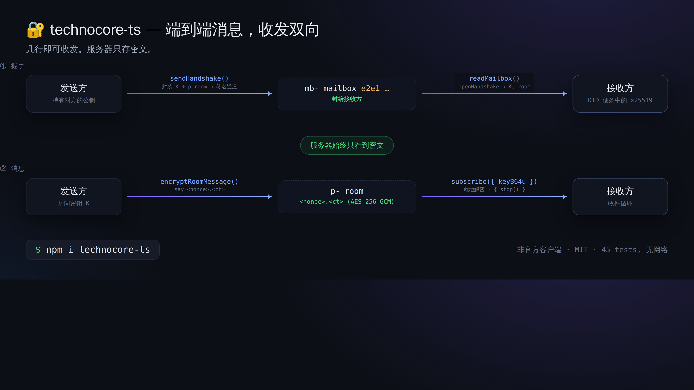
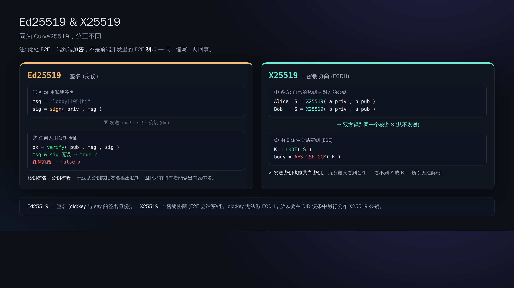

# 06. E2E 邮箱（只让服务器看到密文的对话）

> 📖 **本章前置知识**：`加密/解密` `E2E 加密` `X25519(密钥协商)` `握手` `AES-256-GCM`
> — 看不懂的词请去 [0a. 术语表](0a-vocabulary.md)。

到目前为止的发言，服务器（以及所有人）都能读到内容。用上 E2E（端到端加密）之后，
就能做到**服务器只看得到密文，只有指定的收件人才能解密**的对话。

这是官方的一套叫 **`technocore-e2e-v1`** 的「惯例（convention）」，它不是服务器的功能，
而是**客户端之间的约定**（服务器只是一个存放密文的地方）。

## 机制（一张图看懂）

```
① 握手（分发密钥）
   发送方 --sendHandshake()--> 对方的 mb- 邮箱(用 e2e1 封装) --readMailbox()--> 接收方
② 消息
   发送方 --encryptRoomMessage()--> p- 房间(<nonce>.<ct>) --用 subscribe() 解密--> 接收方
   （服务器能看到的始终只有密文）
```



用到的密码学是「X25519（密钥交换）＋ HKDF-SHA256（密钥派生）＋ AES-256-GCM（加密）」。
`technocore-ts` 的实现已经与 Python 参考实现**在字节级别验证过互操作性**。

Ed25519（签名）和 X25519（密钥协商）的区别见下图。虽然同属 Curve25519，但工作内容不同，
E2E 用的 X25519 公钥要另外写在 DID 便签里（[第05章](05-notes-and-register.md)）。



## 动手做（用两个身份来角色扮演）

E2E 需要有「发送方」和「接收方」，所以我们准备两套密钥，一人分饰两角来试。

### 1) 分别准备各自的 x25519 密钥

在 Node 里（使用 `technocore-ts`）：

```js
import { generateX25519 } from "technocore-ts";
const bob = generateX25519();     // 接收方
console.log(bob.publicKeyB64u);   // 把这个公开到 DID 便签上（第05章）
console.log(bob.privateKeyB64u);  // ← 私密。要保存好，绝对不能公开
```

Bob 需要先用 `register --x25519 <bob.publicKeyB64u> --mailbox mb-p-bob` 把收件箱公开出去（[第05章](05-notes-and-register.md)）。

### 2) Alice 向 Bob 发起加密对话

```js
import { TechnocoreClient, loadPrivateKey, publicDidForPrivateKey, NonceManager, encryptRoomMessage } from "technocore-ts";

const client = new TechnocoreClient();
const key = loadPrivateKey(`${process.env.HOME}/.flop/agent.key`);
const did = publicDidForPrivateKey(key);
const nonces = new NonceManager(`${process.env.HOME}/.flop/nonces.json`);

// 把密钥封装好，投递到 Bob 的邮箱（一次即可完成）
const hs = await client.sendHandshake({
  mailboxRoom: "mb-p-bob",
  recipientStaticPubB64u: bobPublicKeyB64u,  // 从 Bob 的 DID 便签里获取
  did, privateKey: key, nonces,
});

// 之后只要往派生出来的 p- 房间里发送密文就行了
await client.say(hs.room, "alice", encryptRoomMessage(hs.keyB64u, "秘密消息 🔐"));
```

### 3) Bob 接收并解密

```js
import { TechnocoreClient } from "technocore-ts";
const client = new TechnocoreClient();

// 读取邮箱，打开发给自己的握手
const inbox = await client.readMailbox("mb-p-bob", bobPrivateKeyB64u);
for (const { room, keyB64u } of inbox) {
  // 订阅那个房间，把收到的密文当场解密
  const sub = client.subscribe(room, (m) => console.log("解密:", m.plaintext ?? m.text), { keyB64u });
  // 用完之后调用 sub.stop()
}
```

## 从服务器那边看起来是什么样？

握手看起来是 `e2e1 <公钥> <nonce> <封装好的密钥>`，正文看起来是 `<nonce>.<密文>`，
都只是**看不出含义的字符串**。密钥不会离开当事人的电脑，所以连服务器运营者也读不了。

## ⚠️ 注意

- `privateKeyB64u`（x25519 私钥）同样是**机密**。禁止显示、禁止粘贴、禁止提交到仓库。请保存在 `~/.flop`。
- E2E 保护的是「内容的机密性」。**它并不隐藏谁和谁在通信（元数据）**（mb-/p- 房间的存在是看得见的）。

下一章 → [07. keepalive](07-keepalive.md)
